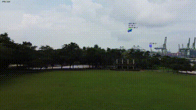
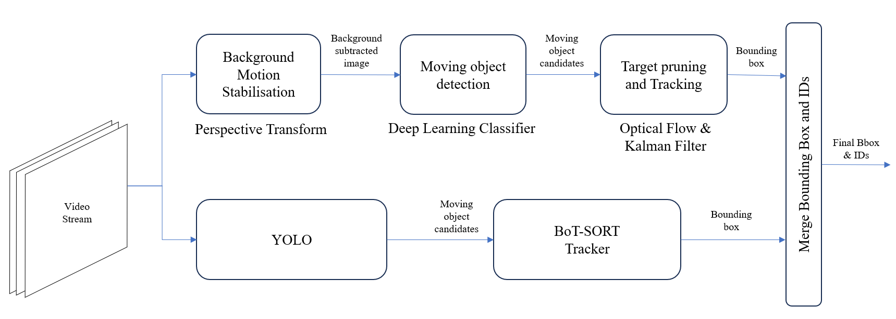

# CUAS

This repository aims to compile valuable information, datasets, and trained models related to countering unmanned aerial systems.



## 1. Datasets

This section provides a brief overview of datasets available for training and evaluating models in the field of Counter Unmanned Aerial Systems (CUAS) detection. These datasets aim to support research and development efforts in identifying and countering unmanned aerial threats.

#### Dataset Statistics

Dataset | Size | Description | Links
--------|------|---------------------|-------
**MAV-VID** | *Training*: 29,500 image <br /> *Validation*: 10,732 images | Contains videos of drones captured from other drones and ground-based cameras | [Link](https://bitbucket.org/alejodosr/mav-vid-dataset/src/master/)
**Drone-vs-Bird** | *Training*: 85,904 images <br /> *Validation*: 18,856 images | Comprises videos of UAV captured at long distances and surrounded by small objects | [Link](https://github.com/wosdetc/challenge/tree/master)
**Anti-UAV** | *Training*: 149,478 images <br /> *Validation*: 37,016 images | Contains RGB and IR recordings in different lightning and background conditions | [Link](https://anti-uav.github.io/dataset/)
**DUT Anti-UAV** | *Training*: 5,200 images <br /> *Validation*: 2,000 images <br /> 20 video clips | Contains videos of drones captured from other drones and ground-based cameras | [Link](https://github.com/wangdongdut/DUT-Anti-UAV)
**Vis-Drone** | 288 video clips (261,908 frames) <br /> 10,209 static images | Drone-captured images of objects, such as pedestrians, cars, bicycles, and tricycles | [Link](https://github.com/VisDrone/VisDrone-Dataset)
**CUAS** | Total 8,555 images | Contains videos of drones captured from other drones and ground-based cameras | [Link](https://universe.roboflow.com/wk-meyzk/cuas-pq71v)


## 2. Trained Weights
[Google Drive](https://drive.google.com/drive/folders/1ZYfYUv00o63Q2O8Ozsd7JQif42KH38Ra?usp=drive_link)

Explore the following pre-trained detection models designed specifically for countering unmanned aerial systems. These models from the Google Drive are ready to be used or fine-tuned for CUAS detection tasks. They trained using various models, including YOLOv8 and Detection Transformers (DETR).

## 3. Challenges of Drone Detection and Tracking
* Out-of-View: Re-ID difficult when the target moves out of the frame.
* Occlusion: Target is partially or heavily occluded.
* Dynamic Background Clusters: Dynamic changes (e.g., buildings, leaves, birds) in the background around the target.
* Low Resolution: Especially when the area of the bounding box is small.
* Target Scale: Target usually occupies a small pixel area.
* Fast & Random Motion: Difficult to predict motion in next timestep.
* Moving Camera: Affects filters used for tracking.
* Limited Computational Resources: Limited by GPU and computing power on drone

## 4. Method 



#### Overview 
Our drone detection methodology is a hybrid approach that integrates a Convolutional Neural Network (CNN) and conventional computer vision techniques to achieve robust and accurate detections. This method leverages the strengths of both deep learning and traditional image processing methods to enhance detection performance.

#### Convolutional Neural Network: YOLOv8
The CNN component utilizes YOLOv8, a state-of-the-art object detection algorithm. We trained YOLOv8 on a custom dataset of over 8,000 images, augmented for variability, to accurately identify drones across various scenarios. The training process involved data collection and annotation, data augmentation, and model training and fine-tuning to optimize performance and generalize effectively.

#### Traditional Computer Vision Techniques
The conventional computer vision component consists of three parts: background motion estimation, spatio-temporal characteristic extraction, and Kalman filter tracking. First, we estimate background motion using a perspective transformation model and perform background subtraction to highlight moving objects. Next, we calculate optical flow to track the movement of detected objects and analyze their spatio-temporal characteristics, identifying potential targets based on motion patterns. Finally, we apply a Kalman filter to track the detected objects, reducing noise and smoothing object trajectories.

#### Merging and Combining Detections
In the final step, we merge the detections from YOLOv8 and the conventional methods. Bounding boxes and tracking IDs are combined, ensuring consistent object identification across frames. A detection is considered positive, and marked with a green bounding box, if both methods detect the same object, reducing false positives and enhancing accuracy. This hybrid approach leverages the strengths of both deep learning and traditional image processing to ensure reliable drone detection in diverse and challenging environments.

## 5. Installation

### Prerequisites
- [Conda](https://docs.conda.io/projects/conda/en/latest/user-guide/install/index.html) must be installed on your system.

### 1. Clone the Repository
First, clone the repository to your local machine:

```bash
git clone https://github.com/cweekiat/CUAS.git
cd CUAS
```

### 2. Create the Conda Environment

Create a new conda environment using the provided environment.yml file:

```bash
conda env create -f environment.yml
conda activate CUAS 
```

### 3. Running the Code

```bash
python3 detect.py 1.mp4
```

#### Usage
Add your videos into ```./data/videos/``` folder and run 
```bash
python3 detect.py [your_video]
```

## License

This project is licensed under the Creative Commons Attribution-NonCommercial 4.0 International License. See the LICENSE file for details.

## Acknowledgments

This project references the detection and tracking model in this paper: 

J. Li, D. Ye, M. Kolsch, J. Wachs and C. Bouman, "Fast and Robust UAV to UAV Detection and Tracking from Video" in IEEE Transactions on Emerging Topics in Computing. doi: 10.1109/TETC.2021.3104555 url: https://doi.ieeecomputersociety.org/10.1109/TETC.2021.3104555

